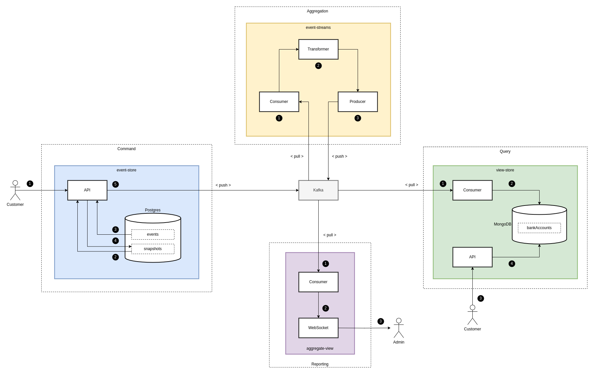
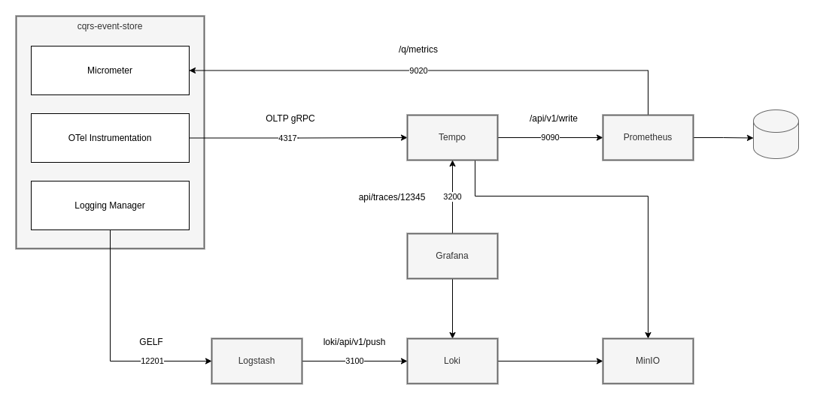
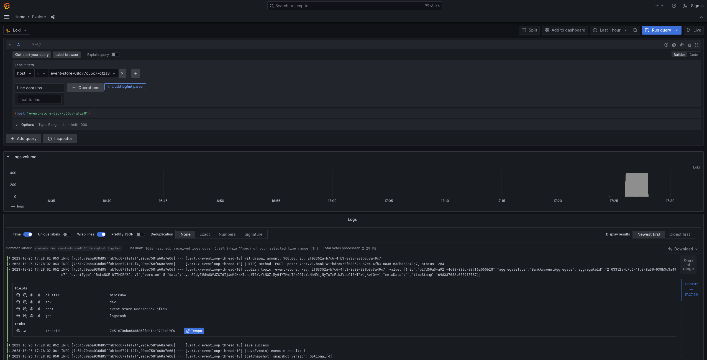

# Event Sourcing (CQRS) tech demo

This project models a basic banking application which allows users to create new accounts, update their account details and deposit and withdraw fund to their accounts.

Using the Command and Query Responsibility Segregation (CQRS) design pattern to isolate the write and read operations and allow scaling of each set of operation separately.

**Reactive programming** - The entire project uses reactive programming to perform as fast as possible.

## Overview
The project uses four different applications to provide all the necessary services for both the customers and business users.


### Event Store
Provides an API for write (command) operations including account creation and update, deposits and withdrawals.

### View Store
Provides an API for reading (query) the customer account data

### Event Streams
Aggregates the data from a stream of real-time account events

### Aggregate View
Provides a real-time view of the aggregated data on accounts to the business.

## Technologies



Some of the main technologies this project demonstrates are:
- Quarkus - This project uses Quarkus, the Supersonic Subatomic Java Framework.
- Postgres: Relational database used to store all account activity in the form of events for all write operations
- MongoDB: Document based database is used to store the latest state of an account for read operations
- Kafka: Storage and transmission of all events to applications in the project
- Kafka Streams: Aggregation of event data to provide real-time account statistics
- Websockets: Provide a real-time view to business users of current account activity from aggregated data

## Kafka Design

Kafka provides the backbone of the project receiving and transmitting events to each of the applications.

### Producers

The Event Store emits events into partitions within the Kafka Topic based on the customer account identifier.  This guarantees the order of the messages is retained on the consumer side. 


### Consumers

The View Store reads events from the Kafka Topic partitions using either a single consumer or multiple consumer in a scaled setup. 


## Observability

This project provides a fully configured monitoring stack for monitoring the applications during operation.



- Metrics - Metrics are published by each app using Micrometer which is polled by a Prometheus instance
- Telemetry - Telemetry is pushed from each application using OpenTelemetry to a Tempo instance
- Log aggregation - Application logs are sent over UDP to Logstash for post-processing and then forwarded to Loki for indexing
- Cloud Storage - MinIO provides Amazon S3 compatible storage for indexes from Loki and Tempo 

### Visualisation
A set of custom Grafana dashboards visualise logs, metrics and telemetry for the running applications:

- APM Dashboard - Show the span metrics generated by Tempo
- Application Dashboard - Custom dashboard visualising application specific metrics
- JVM Quarkus - Shows JVM related metrics for each of the applications


### Grafana Setup
Grafana has a full set of configured data sources with linking to allow the full use of the following features:

#### Service graphs
Service graphs visually map the request between the services in the project and including timing and error rate information.


#### Node graphs
Node graphs visually map the calls and timings between the various service and infrastructure for a specific action.


#### Trace to Log
Telemetry is linked back to the associated log entry using the MDC information (traceId/spanId) present in the log line
entries.  This allows you to see the log messages happening at the time the telemetry data was logged.


#### Log to trace
Logs are correlated with telemetry data using MDC information (traceId/spanId) to allow you to jump straight from a 
single log entry to the telemetry data associated with the activity.



#### Trace to Metrics
Telemetry is also associated with the metrics collected from the application within a certain time frame, this gives
context to a single telemetry entry as you can see if the data was just a glitch or whether it was part of a larger increase in the response times.


## Deployment

The applications and associated monitoring stack have deployment profiles for Kubernetes.


## Load testing

The load tests are written using the Gatling load testing framework and each test provides insight into the application
performance under different load conditions.

- Smoke Test - Simple one shot test to prove the applications are responding
- Target Load Test - Used to prove the application can meet the required target transactions per second (TPS)
- Soak Test - Used to look for memory leaks and other longer term issues
- Spike Test - Proves the application can handle traffic spikes
- Fatigue Test - Used to show the maximum traffic an application can handle before breaking


Results are published by Galting to to HTML reports:


# Development

## Running the application in dev mode

You can run your application in dev mode that enables live coding using:
```shell script
mvn compile quarkus:dev
```

> **_NOTE:_**  Quarkus now ships with a Dev UI, which is available in dev mode only at http://localhost:8080/q/dev/.

## Packaging and running the application

The application can be packaged using:
```shell script
mvn package
```
It produces the `quarkus-run.jar` file in the `target/quarkus-app/` directory.
Be aware that it’s not an _über-jar_ as the dependencies are copied into the `target/quarkus-app/lib/` directory.

The application is now runnable using `java -jar target/quarkus-app/quarkus-run.jar`.

If you want to build an _über-jar_, execute the following command:
```shell script
mvn package -Dquarkus.package.type=uber-jar
```

The application, packaged as an _über-jar_, is now runnable using `java -jar target/*-runner.jar`.

## Creating a native executable

You can create a native executable using: 
```shell script
mvn package -Pnative
```

Or, if you don't have GraalVM installed, you can run the native executable build in a container using: 
```shell script 
mvn package -Pnative -Dquarkus.native.container-build=true
```

You can then execute your native executable with: `./target/event-sourcing-1.0.0-SNAPSHOT-runner`

If you want to learn more about building native executables, please consult https://quarkus.io/guides/maven-tooling.

# Testing the Native image

To test the native image, run the integration tests against the generated binary:
```shell
mvn verify -Pnative
```

## Related Guides

- SmallRye Fault Tolerance ([guide](https://quarkus.io/guides/microprofile-fault-tolerance)): Build fault-tolerant network services
- Hibernate Validator ([guide](https://quarkus.io/guides/validation)): Validate object properties (field, getter) and method parameters for your beans (REST, CDI, JPA)
- RESTEasy Reactive ([guide](https://quarkus.io/guides/resteasy-reactive)): A JAX-RS implementation utilizing build time processing and Vert.x. This extension is not compatible with the quarkus-resteasy extension, or any of the extensions that depend on it.
- SmallRye Reactive Messaging - Kafka Connector ([guide](https://quarkus.io/guides/kafka-reactive-getting-started)): Connect to Kafka with Reactive Messaging
- JDBC Driver - PostgreSQL ([guide](https://quarkus.io/guides/datasource)): Connect to the PostgreSQL database via JDBC for Flyway database creation
- Reactive PostgreSQL client ([guide](https://quarkus.io/guides/reactive-sql-clients)): Connect to the PostgreSQL database using the reactive pattern for database access

# Docker deployment

## Pre-requisites
You should have a recent version of Docker installed (19.03.0+)

Deploy the infrastructure to Docker:
```shell
docker-compose -f docker-compose.yml up -d
```

Next you need to build the Docker container images from the applications:
```shell
mvn clean package \
  -DskipTests \
  -Dquarkus.container-image.build=true \
  -Dquarkus.container-image.group=cqrs
```

If you wish to build a native version of the application into the container image, then use the following command:
```shell
mvn clean package \
  -Pnative \
  -DskipTests \
  -Dquarkus.container-image.build=true \
  -Dquarkus.container-image.group=cqrs
```

Finally, run the packaged application containers as a single platform:
```shell
docker-compose -f docker-compose-dev.yml up -d
```

## Manual testing
You can manually call the application API to create a new account and perform some actions.

To view the aggregated bank account information produced by the `event-stream` application as the tests run, open the Websocket enabled application at `localhost:9040`.

To run the commands against the local instances, create the following env vars:
```shell
export EVENT_STORE_URL=localhost:9020
export VIEW_STORE_URL=localhost:9010
```

Now you can run the commands script which will execute all the bank account commands and then query back the latest state of the account from the query side.
```shell
./commands.sh
```

# Kubernetes deployment

## Pre-requisites
If you have not already, start Minikube and wait for it to become ready.
```shell
minikube start --memory=8096 --cpus=6 --bootstrapper=kubeadm && \
minikube addons enable dashboard && \
minikube addons enable metrics-server
```

Once the Minikube cluster has started, we can start the Minikube Dashboard for monitoring the infrastructure as we
deploy it.  Once started, the Dashboard will open in a new browser session.
```shell
minikube dashboard
```
_Note: This will block the current terminal session until you exit._

**Important: All infrastructure will be created in a new separate namespace.  You will need to select the `cqrs` namespace in the Dashboard UI (top banner) to be able to manage these resources.**


Before we can deploy the applications we must set up the necessary infrastructure in the Kubernetes cluster.

Create a new namespace for the whole platform:
```shell
kubectl create ns cqrs
```

Deploy the infrastructure to Kubernetes:
```shell
kubectl apply -f ./kubernetes/postgres.yml -n cqrs
kubectl apply -f ./kubernetes/mongo.yml -n cqrs
kubectl apply -f ./kubernetes/kafka.yml -n cqrs
```

To access the Kafka server in the Kubernetes cluster, we must add a new Pod running Kafka client tools:
```shell
kubectl run kafka-client -n cqrs --rm -ti --image bitnami/kafka:3.4 -- bash
I have no name!@kafka-client:/$ /opt/bitnami/kafka/bin/kafka-console-consumer.sh --bootstrap-server=BROKER://kafka-svc.cqrs.svc.cluster.local:9092 --topic event-store --from-beginning --partition 0
```

## Deploying the applications

The next step is to package the application into containers which can then be deployed directly into the Kubernetes cluster.

**Important:** We must build the image via the Minikube Docker Daemon to make it available to the Kubernetes cluster for deployment:
```
eval $(minikube -p minikube docker-env)
```

### Standard JAR build
To deploy a standard Java JAR deployment, use the following command:
```
mvn clean package \
    -DskipTests=true \
    -Dquarkus.container-image.build=true \
    -Dquarkus.container-image.group=cqrs \
    -Dquarkus.kubernetes.namespace=cqrs \
    -Dquarkus.kubernetes.deploy=true
```

### Native image build
To deploy a native image version of the application, use the following commands:
```
mvn clean package \
    -Pnative \
    -DskipTests=true \
    -Dquarkus.container-image.build=true \
    -Dquarkus.container-image.group=cqrs \
    -Dquarkus.native.remote-container-build=true \
    -Dquarkus.kubernetes.namespace=cqrs \
    -Dquarkus.kubernetes.deploy=true
```

## Scale the consumers

### Manually scaling consumers
Once all the consumers come up, we can scale each of the services horizontally using the following command:
```shell
kubectl scale -n cqrs deployment view-store --replicas=3
```

### Horizontal Pod Auto-scaling
If we want to perform auto-scaling based on CPU or memory consumption of the applications, then we can use a Kubernetes
HPA rules to scale the instances up and down.  The example included will spin up a new instance when all the running
Pods have exceeded 75% CPU utilisation.  When CPU utilisation drops below 75% across all Pods, then the instances will
be scaled back down.
```shell
kubectl autoscale deployment view-store -n cqrs --cpu-percent=75 --min=1 --max=3
```

To remove or adjust the auto-scaling you can use the following command:
```shell
kubectl delete -n cqrs horizontalpodautoscaler view-store
```

To see the HPA in action you can run the following command whilst a load test is being performed.

```shell
kubectl get hpa view-store -n cqrs --watch
NAME         REFERENCE               TARGETS    MINPODS   MAXPODS   REPLICAS   AGE
view-store   Deployment/view-store   2%/50%     1         3         1          2m3s
view-store   Deployment/view-store   3%/50%     1         3         1          3m
view-store   Deployment/view-store   104%/50%   1         3         1          4m
view-store   Deployment/view-store   104%/50%   1         3         3          4m15s
view-store   Deployment/view-store   210%/50%   1         3         3          5m
view-store   Deployment/view-store   105%/50%   1         3         3          6m
view-store   Deployment/view-store   49%/50%    1         3         3          7m
view-store   Deployment/view-store   1%/50%     1         3         3          8m
view-store   Deployment/view-store   2%/50%     1         3         3          9m
view-store   Deployment/view-store   1%/50%     1         3         3          10m
view-store   Deployment/view-store   1%/50%     1         3         3          11m
view-store   Deployment/view-store   2%/50%     1         3         3          12m
view-store   Deployment/view-store   2%/50%     1         3         3          12m
view-store   Deployment/view-store   1%/50%     1         3         1          13m
```

As the CPU utilization increases the number of pods will scale from 1 to 3 to process the incoming requests.  Once the
test is complete and CPU utilization drops below the target of 75% the number of pods will be decreased.
_Note: It can take up to 5 minutes after the test completes before the number of pods are scaled back down_

## Testing

### Standard JAR testing 
To test the standard JAR version of the application you can run the standard integration tests:
```shell
mvn clean verify
```

### Native image testing
Integration tests are used to make sure that the application functions correct once it has been converted to a native application.
```shell
mvn clean verify -Pnative
```

Note: If you receive an error similar to the following:
```shell
Error: Invalid Path entry event-store-1.0.0-SNAPSHOT-runner.jar
Caused by: java.nio.file.NoSuchFileException: /project/event-store-1.0.0-SNAPSHOT-runner.jar
```
Then check you are not connected to the Minikube docker instance! An easy way to check is by running `docker ps` and
checking the output for `k8.io` based containers. You can always start a new terminal to make sure.

## Manual testing
You can manually call the application API to create a new account and perform some actions.

To run the commands against the local instances, create the following env vars:
```shell
export EVENT_STORE_URL=localhost:9020
export VIEW_STORE_URL=localhost:9010
export AGGREGATE_VIEW_URL=localhost:9040
```

To run the commands against a Kubernetes deployment, create the following env vars:
```shell
export EVENT_STORE_URL=$(minikube service --url event-store -n cqrs | head -n 1)
export VIEW_STORE_URL=$(minikube service --url view-store -n cqrs | head -n 1)
export AGGREGATE_VIEW_URL=$(minikube service --url aggregate-view -n cqrs | head -n 1)
```

Now you can run the commands script which will execute all the bank account commands and then query back the latest state of the account from the query side.
```shell
./commands.sh
```
cd 
# Monitoring

The application provides full observability of the application stack using:
- Logstash, Loki and MinIO for log aggregation and storage
- Prometheus and Tempo for application metrics aggregation and processing
- Cadvisor for infrastructure and container metrics
- Grafana for visualisation of all logs and metrics from infrastructure and applications
- Application level health and readiness endpoints for readiness and liveness probes

The Grafana UI can be accessed at http://localhost:3005/ and provides a number of custom dashboards for monitoring the Docker infrastructure and the application stack:
- APM Dashboard - Show the span metrics generated by Tempo
- Application Dashboard - Custom dashboard visualising application specific metrics
- Cadvisor exporter - Show metrics related to all infrastructure containers
- JVM Quarkus - Shows JVM related metrics for each of the applications

## Docker Setup
To set up the monitoring on Docker, you simply need to run the `docker-compose` script:
```shell
docker compose -f ./monitoring/docker-compose-monitoring.yml up -d
```
To remove all the Docker monitoring, use the same script to stop the Docker instances:
```
docker compose -f ./monitoring/docker-compose-monitoring.yml down -v
```
_Important: The `-v` flag will remove all the Docker volumes and data associated with Docker instances.

### Kubernetes Setup
To set up the monitoring on the Kubernetes cluster, you can run the setup script which will deploy all necessary
resources:
```shell
./kubernetes/monitoring/setup.sh
```

In the event that you want to delete all the deployed Kubernetes monitoring, you can run the tear down script:
```shell
./kubernetes/monitoring/teardown.sh
```

Below is more information on each of the specific technologies used to provide observability and how to call some of the
more important endpoints in the event you need to debug.

## Tempo

### Configuration
```shell
curl localhost:3200/status/config | grep metrics
```

### Metrics
Tempo will show metrics which indicate the state of the `metrics-generator`:
```shell
curl http://localhost:3200/metrics | grep tempo_metrics_generator
```

### Trace by ID
```shell
curl http://localhost:3200/api/traces/154634d2162353cb2d0ed94ab1bde6f0
```

Tempo [span metrics processor](https://grafana.com/docs/tempo/latest/metrics-generator/span_metrics/) exports the following metrics to the configured Prometheus instance:
- `traces_spanmetrics_latency` - Duration of the span (Histogram)
- `traces_spanmetrics_calls_total` - Total count of the span (Counter)
- `traces_spanmetrics_size_total` - Total size of spans ingested (Counter)

Tempo [service graphs](https://grafana.com/docs/tempo/latest/metrics-generator/service_graphs/#service-graphs) exports the following metrics to the configured Prometheus instance:
- `traces_service_graph_request_total` - Total count of requests between two nodes (Counter)
- `traces_service_graph_request_failed_total` - Total count of failed requests between two nodes (Counter)
- `traces_service_graph_request_server_seconds` - Time for a request between two nodes as seen from the server (Histogram)
- `traces_service_graph_request_client_seconds` - Time for a request between two nodes as seen from the client (Histogram)
- `traces_service_graph_unpaired_spans_total` - Total count of unpaired spans (Counter)
- `traces_service_graph_dropped_spans_total` - Total count of dropped spans (Counter)

## Prometheus

The main Prometheus dashboard can be accessed at http://localhost:9090/

Query Prometheus for the relevant metrics:
```shell
curl 'http://localhost:9090/api/v1/query?query=traces_spanmetrics_latency_bucket'
{"status":"success","data":{"resultType":"vector","result":[]}}
```

```shell
export PROMETHEUS_URL=$(minikube service --url prometheus-svc -n monitoring | head -n 1)
curl "$PROMETHEUS_URL/api/v1/label/kubernetes_name/values" | jq
{
  "status": "success",
  "data": [
    "aggregate-view",
    "event-store",
    "event-streams",
    "kube-dns",
    "view-store"
  ]
}
```

### Exemplars

Quarkus supports Exemplars (metrics with an associated `traceId` and `spanId`) via Prometheus using the standard `quarkus-micrometer-prometheus` extension.

By adding the `@Timed` annotation to your methods, you will see that Prometheus metrics will contain the extra information.
```shell
curl -v http://localhost:9010/q/metrics | grep view_store_message_process_seconds_bucket
view_store_message_process_seconds_bucket{class="com.example.BankAccountResource",exception="none",method="getAllByBalance",le="0.016777216"} 2.0 # {span_id="d1f2591c877b95b9",trace_id="08c32eb410514f827454363c63fc1ebb"} 0.016702041 1684067985.642
```
_Note: Not every entry will have traceId and spanId as Exemplars are sampled data, not all the data._

## Logstash

```shell
curl -XGET 'localhost:9600/?pretty'
curl -XGET 'localhost:9600/_node/pipelines?pretty'
```

You can test that the Logstash server is receiving data by using the `nc` command:
```shell
echo '{"message": {"someField":"someValue"} }' > tmp.json
nc localhost:5400 < tmp.json
```

## Loki

Logs received by Logstash will be exported to Loki for ingestion and storage.

Labels are an [extremely important factor](https://grafana.com/docs/loki/latest/get-started/labels/) when working with Loki.

You can query the amount of labels generated by Logstash and Prometheus using the following command:
```shell
curl -G -s  "http://localhost:3100/loki/api/v1/labels" | jq
{
  "status": "success",
  "data": [
    "cluster",
    "env",
    "host",
    "job"
  ]
}
```

To query the logs in Loki:
```shell
curl -G -s  "http://localhost:3100/loki/api/v1/query_range" --data-urlencode 'query={host="event-store-8569c899c4-gvr27"} |= ``' | jq
```

## MinIO
Storage for the logs is provided by a local Docker container using [MinIO Simple Storage Service (aka S3)](http://min.io).

Access to the MinIO dashboard at http://localhost:9001/ using credentials of `minioadmin` and `minioadmin`

# Load Testing

The load tests are written using the Gatling load testing framework and each test provides insight into the application 
performance under different load conditions.

- Smoke Test - Simple one shot test to prove the applications are responding
- Target Load Test - Used to prove the application can meet the required target transactions per second (TPS)
- Soak Test - Used to look for memory leaks and other longer term issues
- Spike Test - Proves the application can handle traffic spikes
- Fatigue Test - Used to show the maximum traffic an application can handle before breaking

Whilst running the load testing you can also view the `aggregate-view` application in your browser to see the results of the `event-streams` application.

**Note:** 
Currently, the load testing are run only from your local machine against the deployed infrastructure.  In a true enterprise load test, the script would be deployed to more than one machine and run in parallel to avoid saturating the network interfaces of the machine running the tests. 

## Test Setup
The test can be run against either your local development setup, Docker setup or Kubernetes deployment by providing
the necessary environment variables.

In the case of local development or Docker setup, the default test values of `localhost` will suffice for access.
When running the tests against Kubernetes, you will need to set the environment variables to the correct URL based on the deployment. Minikube can provide a list of URLs for the deployment:
```shell
export EVENT_STORE_URL=$(minikube service --url event-store -n cqrs | head -n 1)
export VIEW_STORE_URL=$(minikube service --url view-store -n cqrs | head -n 1)
export AGGREGATE_VIEW_URL=$(minikube service --url aggregate-view -n cqrs | head -n 1)
```

### Smoke Test
No additional environment variables are required to run the smoke test as these are single shot requests to the applications.
```shell
mvn gatling:test -Dgatling.simulationClass=cqrs.SmokeTestSimulation
```

### Target Load Test
The following environment variables can be used to configure the tests for either Target Load or Soak testing:
```shell
export TARGET_TPS=10
export TARGET_TPS_DURATION_IN_SECS=30
export TARGET_TPS_RAMP_PERIOD_IN_SECS=5
mvn gatling:test -Dgatling.simulationClass=cqrs.TargetLoadSimulation
```

### Spike Test
The following environment variables can be used to configure the tests for Spike testing:
```shell
export SPIKE_BASE_TPS=10.0
export SPIKE_RAMP_DURATION=10
export SPIKE_MAX_TPS=50
export SPIKE_INTERVAL=10
mvn gatling:test -Dgatling.simulationClass=cqrs.SpikeTestSimulation
```

### Fatigue Test
The following environment variables can be used to configure the tests for Fatigue testing:
```shell
export FATIGUE_INITIAL_TARGET_TPS=10.0
export FATIGUE_STEP_TPS_INCREASE=5.0
export FATIGUE_STEP_DURATION=10
export FATIGUE_TOTAL_STEP_COUNT=4
mvn gatling:test -Dgatling.simulationClass=cqrs.FatigueTestSimulation
```

# Scaling out with Gatling open-source
Gatling open-source does not have a cluster mode, but you can achieve similar results manually. You will have to configure all your load injectors, and aggregate the results manually. The steps are:

- deploy Gatling on several machines along with the Simulation classes and the associated resources (data, bodies, etc…)
- launch them remotely from a script, with the -nr (no reports) option
- retrieve all the simulation.log files
- rename them so they don’t clash
- place them into a folder in the results folder of a Gatling instance
- generate the reports with Gatling with the -ro name-of-the-simulation-folder (reports only), Gatling will pick all the files that match .*\.log

## Jenkins
A full Jenkins installation and all required configuration is already provided to run the load test in a distributed manner. 

### Docker

To start up the Jenkins server and 2 agents you can use the following command:
```shell
docker compose -f docker-compose-jenkins.yml up -d
```

Once the containers have started you can access the Jenkins UI at `http://localhost:8080/`.

Perform a login using the `Log in` link in the top-right with a username of `admin` and password of `butler`. 

The `LoadTestJob` will perform the load test for the project.

#### Jenkins agents
The master node will orchestrate the tests, and the slave nodes will perform the actual load test requests.

The master and slave node labels are defined in the `Jenkinsfile`.

### Kubernetes

Install the Jenkins Kubernetes Operator using the following command:
```
kubectl apply -f https://raw.githubusercontent.com/jenkinsci/kubernetes-operator/master/config/crd/bases/jenkins.io_jenkins.yaml
```

Create the `jenkins` namespace to hold all resources:
```
kubectl create ns jenkins
```

Install the Operator in `jenkins` namespace with:
```
kubectl apply -n jenkins -f https://raw.githubusercontent.com/jenkinsci/kubernetes-operator/master/deploy/all-in-one-v1alpha2.yaml
```

To start up the Jenkins server use the following command:
```
kubectl apply -n jenkins -f kubernetes/jenkins/jenkins-instance.yml
```

Once the Jenkins instance has been deployed you will need to set up port forwarding to gain access to the Jenkins UI at `http://localhost:8080/`.
```
kubectl port-forward -n jenkins jenkins-load-test 8080:8080
```

To log in you will need the username and password which can be obtained using the following commands:
```
kubectl get secret -n jenkins jenkins-operator-credentials-load-test -o 'jsonpath={.data.user}' | base64 -d
kubectl get secret -n jenkins jenkins-operator-credentials-load-test -o 'jsonpath={.data.password}' | base64 -d
```

## Executing the tests

### First run
Click the `Build now` button to download the Jenkins pipeline job and complete the Jenkins setup.  The job will fail
because you have not yet been able to define the necessary environment variables.  Do not worry, after this run 
completes you will be able to do this via the UI.

### Subsequent runs
Now you can click the `Build with parameters` button which will provide a UI with all the load test attributes which
can be configured on a per-run basis.

